# TryHackMe - SpookySec

## Overview

SpookySec is a Windows Active Directory penetration-testing lab from TryHackMe.

The objective was to enumerate the target environment, identify valid domain accounts, obtain access through weaknesses in Kerberos authentication, and progress through the environment to achieve the objectives of the room.

### Environment

- Platform: TryHackMe
- Operating System: Windows
- Domain: `spookysec.local`
- Target IP: `10.113.173.38`
- Attacker Machine: Kali Linux
- Assessment Type: Active Directory penetration testing

### Methodology

The assessment followed a structured attack path:

1. Network reconnaissance
2. Active Directory user enumeration
3. Kerberos enumeration
4. AS-REP roasting
5. Credential discovery
6. Authentication and lateral movement
7. Privilege escalation
8. Post-exploitation enumeration

## 1. Reconnaissance

The target host was identified as `10.113.173.38`. Initial reconnaissance focused on identifying exposed TCP services and determining the role of the host.

A full TCP port scan was performed:

```bash
nmap -Pn -p- --min-rate 2000 -oN nmap-full.txt 10.113.173.38
```

The scan identified numerous open ports, including services commonly associated with Microsoft Active Directory such as DNS, Kerberos, LDAP, SMB, RDP, WinRM, and Active Directory Web Services.

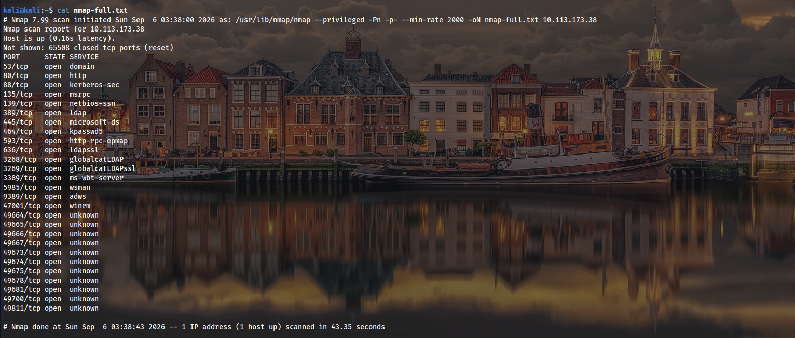

A service and version scan was then performed against the discovered services:

```bash
nmap -Pn -sC -sV -p 53,80,88,135,139,389,445,464,593,636,3268,3269,3389,5985,9389,47001 -oN nmap-services.txt 10.113.173.38
```

The results identified the following important services:

* `53/tcp` — DNS
* `80/tcp` — Microsoft IIS 10.0
* `88/tcp` — Kerberos
* `389/tcp` — Active Directory LDAP
* `445/tcp` — SMB
* `636/tcp` — LDAPS
* `3268/tcp` — Global Catalog LDAP
* `3269/tcp` — Global Catalog LDAPS
* `3389/tcp` — RDP
* `5985/tcp` — WinRM
* `9389/tcp` — Active Directory Web Services

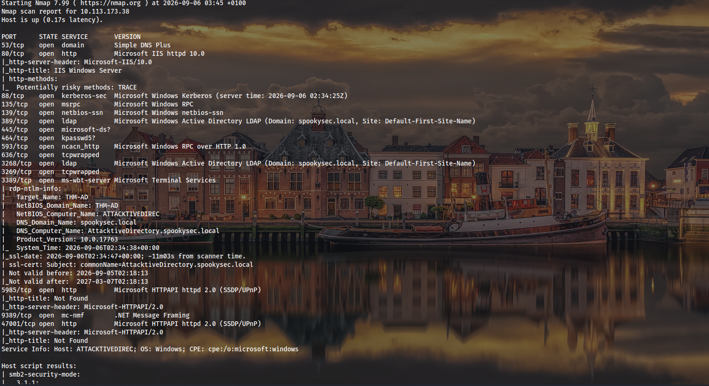

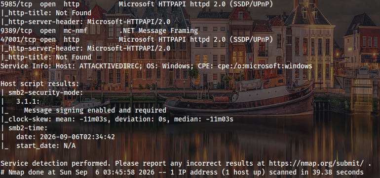

The RDP enumeration also disclosed the Active Directory environment:

* NetBIOS domain: `THM-AD`
* NetBIOS computer name: `ATTACKTIVEDIREC`
* DNS domain: `spookysec.local`
* DNS computer name: `AttacktiveDirectory.spookysec.local`
* Windows version: `10.0.17763`

The presence of Kerberos, LDAP, SMB, Global Catalog, and Active Directory Web Services strongly indicated that the target was a domain controller.

LDAP RootDSE enumeration was performed to obtain additional directory information:

```bash
nmap -Pn -p389 --script ldap-rootdse 10.113.173.38
```

The RootDSE response confirmed the domain naming context:

`DC=spookysec,DC=local`

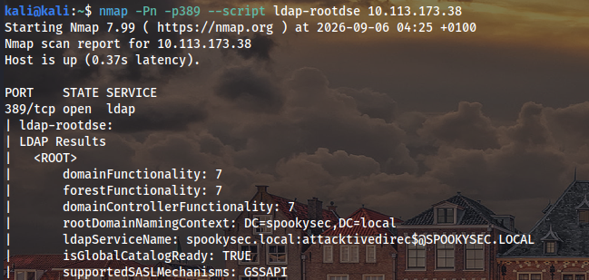

Additional LDAP information confirmed the domain's naming contexts and the domain controller hostname:

`AttacktiveDirectory.spookysec.local`

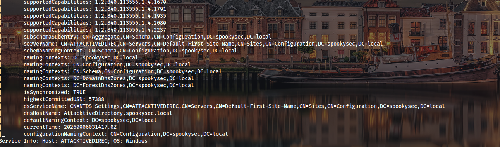

### Reconnaissance Findings

The reconnaissance phase established that the target was a Windows Active Directory domain controller for the `spookysec.local` domain. The exposed Kerberos, LDAP, SMB, and other AD-related services provided several potential avenues for further enumeration.

## 2. User Enumeration

After identifying the target as an Active Directory domain controller for `spookysec.local`, the next step was to identify valid domain accounts.

Kerbrute was used to perform username enumeration against the domain controller:

```bash
kerbrute userenum --dc 10.113.173.38 -d spookysec.local users.txt
```

The enumeration identified several valid domain accounts, including:

* `james`
* `svc-admin`
* `robin`
* `darkstar`
* `administrator`
* `backup`
* `paradox`

These usernames were saved and used for further Kerberos-based enumeration.


The `svc-admin` account was particularly interesting because service accounts can sometimes be configured without Kerberos pre-authentication, making them potential candidates for AS-REP roasting.

## 3. AS-REP Roasting

The discovered usernames were tested for accounts that did not require Kerberos pre-authentication.

Impacket's `GetNPUsers` was used:

```bash
impacket-GetNPUsers -dc-ip 10.113.173.38 spookysec.local/ -usersfile valid_users.txt
```

The results showed that most of the tested accounts required Kerberos pre-authentication.

However, an AS-REP response was successfully obtained for the `svc-admin` account.

The response contained a Kerberos hash in the `$krb5asrep$23$` format, indicating an AS-REP response using encryption type 23 (RC4-HMAC).

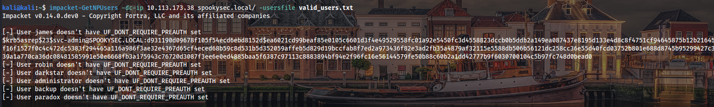

The `svc-admin` account was therefore vulnerable to AS-REP roasting because Kerberos pre-authentication was not required for the account.

The extracted hash was saved locally for offline password cracking.

## 4. Credential Discovery

The captured AS-REP hash was subjected to offline password cracking using Hashcat.

Hashcat mode `18200` was used for Kerberos 5 AS-REP etype 23:

```bash
hashcat -m 18200 hash passwords.txt
```

The hash was successfully cracked.

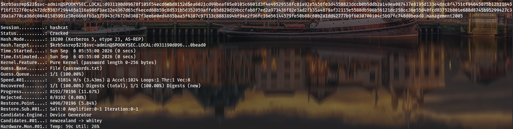

The recovered `svc-admin` password was then used to authenticate to the target.

> The recovered password is redacted from this public write-up.

Authenticated SMB enumeration was performed:

```bash
smbclient -L //10.113.173.38\\ -U 'svc-admin'
```

The server exposed several shares:

* `ADMIN$`
* `backup`
* `C$`
* `IPC$`
* `NETLOGON`
* `SYSVOL`

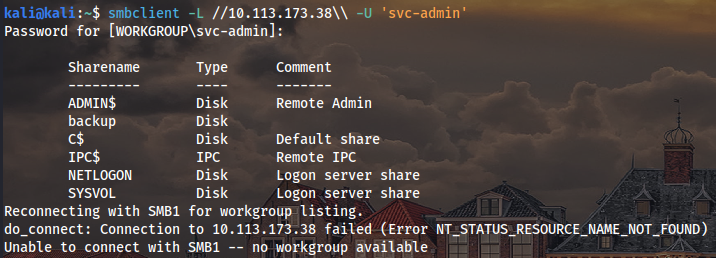

The `backup` share was particularly interesting because it was accessible using the compromised `svc-admin` account.

The share was accessed with:

```bash
smbclient \\\\10.113.173.38\\backup -U 'svc-admin'
```

Directory enumeration revealed `backup_credentials.txt`.

The file was downloaded using:

```text
get backup_credentials.txt
```

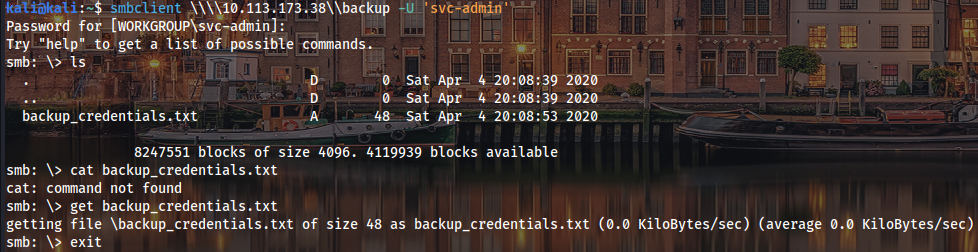

The downloaded file contained Base64-encoded information. After decoding the contents, credentials for the `backup` account were discovered.


The discovered credential is redacted from this public write-up:

```text
backup@spookysec.local:[REDACTED]
```

This provided access to a second domain account with significantly greater privileges.

## 5. Initial Access

The initial authenticated access was obtained using the compromised `svc-admin` account.

The account provided access to SMB services and the `backup` share. A sensitive credential file was discovered within that share, leading to the compromise of the `backup` account.

The progression at this stage was:

```text
AS-REP Roasting
       ↓
svc-admin hash
       ↓
Offline password cracking
       ↓
svc-admin credentials
       ↓
SMB authentication
       ↓
backup share
       ↓
backup_credentials.txt
       ↓
backup account credentials
```

## 6. Privilege Escalation

The compromised `backup` account was used to perform domain credential extraction with Impacket's `secretsdump`.

```bash
impacket-secretsdump -just-dc 'spookysec.local/backup:[REDACTED]@10.113.173.38'
```

The `-just-dc` option was used to target domain controller credential information. The tool successfully used the DRSUAPI method to retrieve secrets from Active Directory.


The output included NTLM hashes for domain accounts, including the Administrator account.

The Administrator hash is redacted:

```text
Administrator:500:[REDACTED]
```

Possession of the Administrator NTLM hash enabled Pass-the-Hash authentication without requiring the plaintext Administrator password.

Evil-WinRM was then used to authenticate to the target:

```bash
evil-winrm -i 10.113.173.38 -u administrator -H [REDACTED]
```

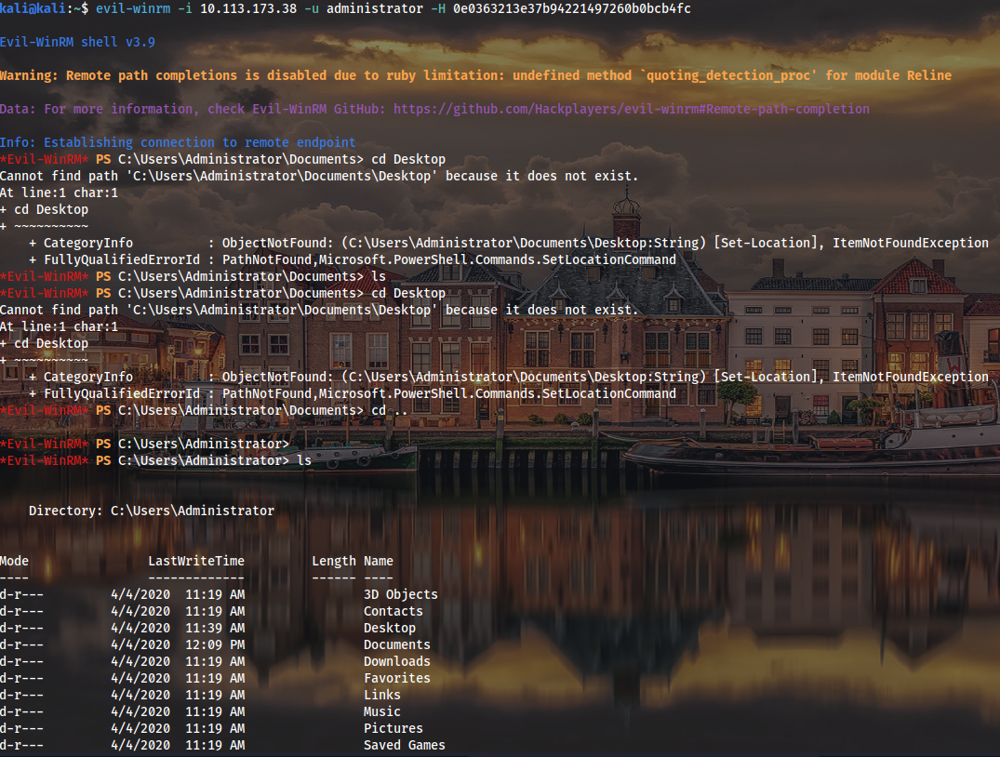

A remote Windows management session was successfully established with Administrator privileges.

## 7. Post-Exploitation

After obtaining the Administrator shell, the Administrator profile was inspected.

The initial working directory was:

```text
C:\Users\Administrator\Documents
```

The parent directory was accessed to locate the Desktop:

```powershell
cd ..
ls
cd Desktop
ls
```

The Administrator Desktop contained the final root-level flag.

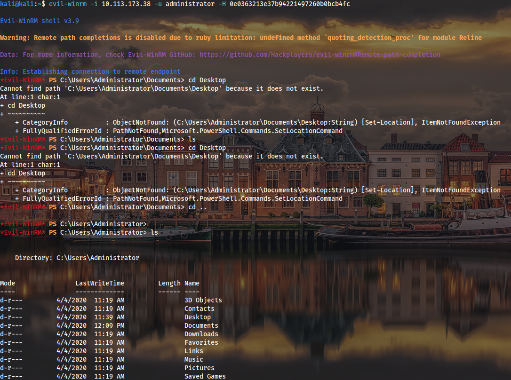

The flag is intentionally redacted from this public write-up:

```text
TryHackMe{[REDACTED]}
```

The successful Administrator session demonstrated complete compromise of the target domain controller.

## 8. Attack Chain

The complete attack path was:

```text
Network Reconnaissance
        ↓
Active Directory Identification
        ↓
User Enumeration
        ↓
AS-REP Roasting
        ↓
svc-admin Hash Obtained
        ↓
Offline Password Cracking
        ↓
svc-admin Compromise
        ↓
SMB Enumeration
        ↓
backup_credentials.txt Discovered
        ↓
backup Account Compromise
        ↓
Domain Credential Dumping
        ↓
Administrator NTLM Hash Obtained
        ↓
Pass-the-Hash
        ↓
Administrator WinRM Access
        ↓
Domain Controller Compromise
```

The compromise resulted from chaining several weaknesses rather than exploiting a single vulnerability.

## 9. Tools Used

The following tools were used during the assessment:

* **Nmap** — Network and service enumeration
* **enum4linux-ng** — Windows/SMB enumeration
* **Kerbrute** — Kerberos username enumeration
* **Impacket GetNPUsers** — AS-REP roasting
* **Hashcat** — Offline password cracking
* **smbclient** — SMB share enumeration and file retrieval
* **Impacket secretsdump** — Active Directory credential extraction
* **Evil-WinRM** — Remote Windows management and Pass-the-Hash authentication

## 10. Key Findings

### AS-REP Roasting

The `svc-admin` account did not require Kerberos pre-authentication, allowing an AS-REP response to be requested and subjected to offline password cracking.

### Weak Account Password

The `svc-admin` password was successfully recovered through offline password cracking, demonstrating insufficient password strength.

### Sensitive Credentials Exposed Through SMB

The `backup` share contained a file that exposed credentials for another domain account.

### Excessive Privileges

The compromised `backup` account had sufficient privileges to perform domain credential extraction through DRSUAPI.

### Administrator Credential Exposure

Domain credential extraction exposed the NTLM hash of the Administrator account.

### Pass-the-Hash

The Administrator NTLM hash was sufficient to establish a remote WinRM session without knowing the plaintext password.

### Domain Controller Compromise

The chained weaknesses ultimately resulted in Administrator-level access to the Active Directory domain controller.

## 11. Mitigations

1. Enable Kerberos pre-authentication for applicable user and service accounts.

2. Review Active Directory accounts for unnecessary use of the `UF_DONT_REQUIRE_PREAUTH` setting.

3. Use strong, unique passwords for service accounts and consider Group Managed Service Accounts (gMSA) where appropriate.

4. Apply the principle of least privilege to backup and service accounts.

5. Regularly audit Active Directory replication permissions and remove unnecessary replication privileges.

6. Do not store credentials in files accessible through SMB shares.

7. Restrict access to administrative and backup SMB shares.

8. Enforce strong password policies and monitor for weak or commonly used passwords.

9. Protect privileged accounts and avoid using domain Administrator accounts for routine activities.

10. Monitor for suspicious AS-REP requests and abnormal Kerberos activity.

11. Monitor for unauthorized directory replication activity and credential dumping.

12. Monitor for Pass-the-Hash authentication and unusual NTLM usage.

13. Restrict administrative services such as SMB, WinRM, LDAP, and RDP through network segmentation and firewall rules.

14. Regularly review Active Directory users, groups, delegated permissions, service accounts, and privileged access.

## 12. Lessons Learned

This assessment demonstrated that an Active Directory environment can be compromised by chaining several individually manageable weaknesses.

The attack began with network reconnaissance and Active Directory identification. User enumeration then revealed valid domain accounts, one of which was vulnerable to AS-REP roasting.

The resulting Kerberos hash was cracked offline, providing access to the `svc-admin` account. SMB enumeration then exposed a backup share containing credentials for the `backup` account.

The compromised `backup` account had sufficient privileges to extract domain credentials from the domain controller. This exposed the Administrator NTLM hash, which was subsequently used for Pass-the-Hash authentication through WinRM.

The assessment demonstrates the importance of securing the entire Active Directory attack surface rather than focusing on individual services in isolation.

The primary security lessons are:

* Minimize unnecessary Active Directory privileges.
* Secure service accounts.
* Require Kerberos pre-authentication where applicable.
* Never expose credentials through network shares.
* Protect domain replication privileges.
* Monitor for credential dumping and Pass-the-Hash activity.
* Regularly audit privileged accounts and delegated permissions.


